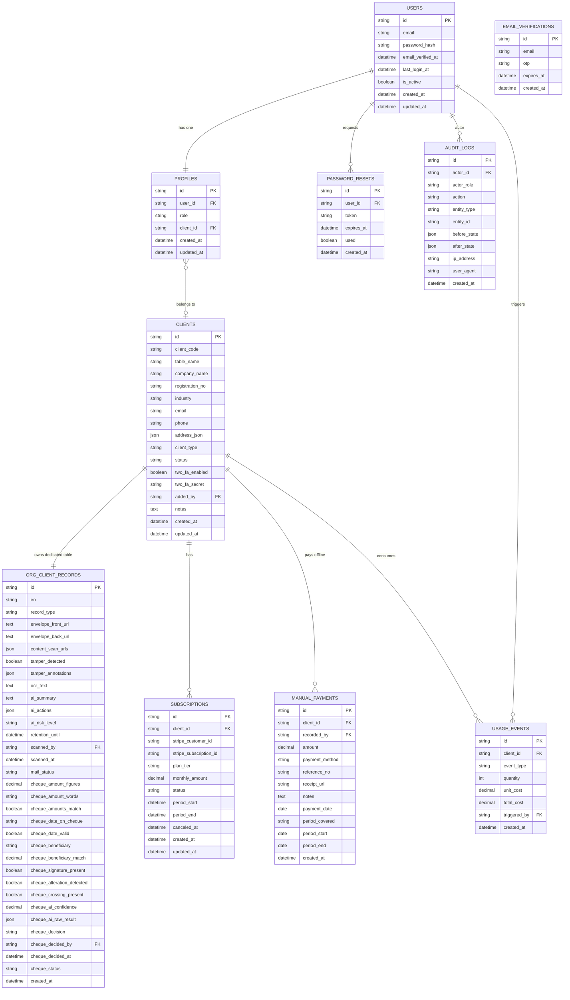

# VScanMail — Database Design V2
**Dynamic Per-Client Table Architecture · MySQL · Drizzle ORM**

---

## 1. Why V2? — The Performance Problem

```
V1 — SHARED TABLES (Problem):
┌─────────────────────────────────────────────────────┐
│              mail_items  (1 shared table)            │
│  client_id = ACME   → row, row, row...              │
│  client_id = LBANK  → row, row, row...              │
│  client_id = GLOBAL → row, row, row...              │
│                                                     │
│  100 companies × 10,000 scans = 1,000,000 rows      │
│  SELECT WHERE client_id = ? → SLOW 🐌               │
└─────────────────────────────────────────────────────┘

V2 — DYNAMIC TABLES (Solution):
┌─────────────────────────────────────────────────────┐
│  org_acme001_records   → ACME only   (~10,000 rows) │
│  org_lbank01_records   → LBANK only  (~8,000 rows)  │
│  org_global99_records  → GLOBAL only (~15,000 rows) │
│                                                     │
│  SELECT * FROM org_acme001_records → FAST 🚀        │
│  Each table is small, isolated, zero cross-data     │
└─────────────────────────────────────────────────────┘
```

---

## 2. Role & Access Matrix

| Feature                          | super_admin | admin | client   |
|----------------------------------|:-----------:|:-----:|:--------:|
| Add / Remove Clients             | ✅          | ❌    | ❌       |
| Manually Add Clients             | ✅          | ❌    | ❌       |
| View All Clients                 | ✅          | ✅    | ❌       |
| Scan Letters (physical scanner)  | ❌          | ✅    | ❌       |
| Scan Cheques (physical scanner)  | ❌          | ✅    | ❌       |
| View Scan Results                | ✅          | ✅    | ✅ (own) |
| Approve / Reject Cheques         | ✅          | ✅    | ✅ (own) |
| View Reports & Analytics         | ✅          | ✅    | ✅ (own) |
| Manage Stripe Subscriptions      | ✅          | ❌    | ✅ (own) |
| Record Manual Payments           | ✅          | ❌    | ❌       |
| System Settings                  | ✅          | ❌    | ❌       |
| Audit Logs                       | ✅          | ✅    | ❌       |

---

## 3. Client Types

```
Type A — Subscription Client        Type B — Manual Client
─────────────────────────────────   ──────────────────────────────
• Self-registers via web            • Super Admin adds manually
• Pays via Stripe (online)          • Pays offline to Super Admin
• client_type = 'subscription'      • client_type = 'manual'
• Auto billing, Stripe invoices     • Manual payment recorded by SA
                                    • Can upgrade to subscription later

Both types get IDENTICAL feature access to the system.
```

---

## 4. Entity Relationship Diagram (ERD)



---

## 5. Architecture Overview

```
┌───────────────────────────────────────────────────────────────────┐
│                     GLOBAL TABLES (9 tables)                      │
│                                                                   │
│  ┌─────────┐ ┌──────────┐ ┌──────────────────┐ ┌──────────────┐  │
│  │  users  │ │ profiles │ │email_verifications│ │password_reset│  │
│  └─────────┘ └──────────┘ └──────────────────┘ └──────────────┘  │
│                                                                   │
│  ┌─────────┐ ┌──────────────┐ ┌────────────────┐                  │
│  │ clients │ │ subscriptions│ │ manual_payments │                  │
│  └─────────┘ └──────────────┘ └────────────────┘                  │
│                                                                   │
│  ┌──────────────┐ ┌────────────┐                                   │
│  │ usage_events │ │ audit_logs │                                   │
│  └──────────────┘ └────────────┘                                   │
└───────────────────────────────────────────────────────────────────┘

┌───────────────────────────────────────────────────────────────────┐
│            DYNAMIC TABLES (1 per client, up to 100)               │
│                                                                   │
│  Auto-created when a new client is added:                         │
│                                                                   │
│  ┌──────────────────────────┐  ┌──────────────────────────┐       │
│  │  org_acme001_records     │  │  org_lbank01_records     │       │
│  │  ─────────────────────   │  │  ─────────────────────   │       │
│  │  • Letters               │  │  • Letters               │       │
│  │  • Cheques + AI data     │  │  • Cheques + AI data     │       │
│  │  • Scan metadata         │  │  • Scan metadata         │       │
│  │  • Client decisions      │  │  • Client decisions      │       │
│  └──────────────────────────┘  └──────────────────────────┘       │
│                                                                   │
│  Max rows per table: ~10,000–50,000 (never millions!)             │
└───────────────────────────────────────────────────────────────────┘
```

---

## 6. Complete MySQL DDL

### 6.1 — Authentication Tables

```sql
-- ─────────────────────────────────────────────────────────────────
-- TABLE: users
-- All login accounts (super_admin, admin, client users)
-- ─────────────────────────────────────────────────────────────────
CREATE TABLE `users` (
  `id`                VARCHAR(36)  NOT NULL,
  `email`             VARCHAR(255) NOT NULL,
  `password_hash`     VARCHAR(255) NOT NULL,
  `email_verified_at` DATETIME     NULL,
  `last_login_at`     DATETIME     NULL,
  `is_active`         BOOLEAN      NOT NULL DEFAULT TRUE,
  `created_at`        DATETIME     NOT NULL DEFAULT CURRENT_TIMESTAMP,
  `updated_at`        DATETIME     NOT NULL DEFAULT CURRENT_TIMESTAMP
                                   ON UPDATE CURRENT_TIMESTAMP,
  PRIMARY KEY (`id`),
  UNIQUE KEY `users_email_uq` (`email`)
);

-- ─────────────────────────────────────────────────────────────────
-- TABLE: profiles
-- Assigns a role and optional client_id to each user
-- role = 'super_admin' : exactly 1, cannot scan
-- role = 'admin'       : 1–3, can scan, cannot add clients
-- role = 'client'      : linked to a company in clients table
-- ─────────────────────────────────────────────────────────────────
CREATE TABLE `profiles` (
  `id`         VARCHAR(36) NOT NULL,
  `user_id`    VARCHAR(36) NOT NULL,
  `role`       ENUM('super_admin','admin','client') NOT NULL,
  `client_id`  VARCHAR(36) NULL,
  `created_at` DATETIME    NOT NULL DEFAULT CURRENT_TIMESTAMP,
  `updated_at` DATETIME    NOT NULL DEFAULT CURRENT_TIMESTAMP
                            ON UPDATE CURRENT_TIMESTAMP,
  PRIMARY KEY (`id`),
  UNIQUE KEY `profiles_user_uq` (`user_id`),
  KEY `profiles_client_idx` (`client_id`),
  KEY `profiles_role_idx`   (`role`),
  CONSTRAINT `profiles_user_fk`
    FOREIGN KEY (`user_id`) REFERENCES `users`(`id`) ON DELETE CASCADE,
  CONSTRAINT `profiles_client_fk`
    FOREIGN KEY (`client_id`) REFERENCES `clients`(`id`) ON DELETE SET NULL
);

-- ─────────────────────────────────────────────────────────────────
-- TABLE: email_verifications
-- OTP codes for email verification during registration
-- ─────────────────────────────────────────────────────────────────
CREATE TABLE `email_verifications` (
  `id`         VARCHAR(36)  NOT NULL,
  `email`      VARCHAR(255) NOT NULL,
  `otp`        VARCHAR(16)  NOT NULL,
  `expires_at` DATETIME     NOT NULL,
  `created_at` DATETIME     NOT NULL DEFAULT CURRENT_TIMESTAMP,
  PRIMARY KEY (`id`),
  KEY `ev_email_idx` (`email`)
);

-- ─────────────────────────────────────────────────────────────────
-- TABLE: password_resets
-- Secure tokens for forgot-password flow
-- ─────────────────────────────────────────────────────────────────
CREATE TABLE `password_resets` (
  `id`         VARCHAR(36)  NOT NULL,
  `user_id`    VARCHAR(36)  NOT NULL,
  `token`      VARCHAR(128) NOT NULL,
  `expires_at` DATETIME     NOT NULL,
  `used`       BOOLEAN      NOT NULL DEFAULT FALSE,
  `created_at` DATETIME     NOT NULL DEFAULT CURRENT_TIMESTAMP,
  PRIMARY KEY (`id`),
  UNIQUE KEY `pr_token_uq` (`token`),
  KEY `pr_user_idx` (`user_id`),
  CONSTRAINT `pr_user_fk`
    FOREIGN KEY (`user_id`) REFERENCES `users`(`id`) ON DELETE CASCADE
);
```

### 6.2 — Clients (Company Registry)

```sql
-- ─────────────────────────────────────────────────────────────────
-- TABLE: clients
-- Central registry for ALL companies (both subscription & manual).
-- The `table_name` column stores the name of this company's
-- dynamic data table (e.g. "org_acme001_records").
-- ─────────────────────────────────────────────────────────────────
CREATE TABLE `clients` (
  `id`              VARCHAR(36)  NOT NULL,
  `client_code`     VARCHAR(32)  NOT NULL,   -- e.g. "ACME001"
  `table_name`      VARCHAR(64)  NOT NULL,   -- e.g. "org_acme001_records"
  `company_name`    VARCHAR(255) NOT NULL,
  `registration_no` VARCHAR(128) NULL,
  `industry`        VARCHAR(128) NOT NULL,
  `email`           VARCHAR(255) NOT NULL,
  `phone`           VARCHAR(64)  NOT NULL,
  `address_json`    JSON         NOT NULL,   -- {street, city, country, postal}
  `client_type`     ENUM('subscription','manual') NOT NULL DEFAULT 'subscription',
  `status`          ENUM('active','suspended','pending','inactive') NOT NULL DEFAULT 'pending',
  `two_fa_enabled`  BOOLEAN      NOT NULL DEFAULT FALSE,
  `two_fa_secret`   VARCHAR(255) NULL,
  `added_by`        VARCHAR(36)  NULL,       -- NULL = self-registered via web
                                             -- non-NULL = super_admin added manually
  `notes`           TEXT         NULL,
  `created_at`      DATETIME     NOT NULL DEFAULT CURRENT_TIMESTAMP,
  `updated_at`      DATETIME     NOT NULL DEFAULT CURRENT_TIMESTAMP
                                 ON UPDATE CURRENT_TIMESTAMP,
  PRIMARY KEY (`id`),
  UNIQUE KEY `clients_code_uq`       (`client_code`),
  UNIQUE KEY `clients_table_name_uq` (`table_name`),
  UNIQUE KEY `clients_email_uq`      (`email`),
  KEY `clients_status_idx`      (`status`),
  KEY `clients_type_idx`        (`client_type`),
  KEY `clients_added_by_idx`    (`added_by`),
  CONSTRAINT `clients_added_by_fk`
    FOREIGN KEY (`added_by`) REFERENCES `users`(`id`) ON DELETE SET NULL
);
```

### 6.3 — Billing Tables

```sql
-- ─────────────────────────────────────────────────────────────────
-- TABLE: subscriptions
-- Stripe subscription records for client_type = 'subscription'
-- Manual clients can also later get a subscription row here.
-- ─────────────────────────────────────────────────────────────────
CREATE TABLE `subscriptions` (
  `id`                      VARCHAR(36)   NOT NULL,
  `client_id`               VARCHAR(36)   NOT NULL,
  `stripe_customer_id`      VARCHAR(255)  NULL,
  `stripe_subscription_id`  VARCHAR(255)  NULL,
  `plan_tier`               ENUM('starter','professional','enterprise') NOT NULL,
  `monthly_amount`          DECIMAL(12,2) NOT NULL DEFAULT '0.00',
  `status`                  ENUM('active','past_due','canceled','trialing','paused')
                            NOT NULL DEFAULT 'trialing',
  `current_period_start`    DATETIME      NOT NULL,
  `current_period_end`      DATETIME      NOT NULL,
  `canceled_at`             DATETIME      NULL,
  `created_at`              DATETIME      NOT NULL DEFAULT CURRENT_TIMESTAMP,
  `updated_at`              DATETIME      NOT NULL DEFAULT CURRENT_TIMESTAMP
                                          ON UPDATE CURRENT_TIMESTAMP,
  PRIMARY KEY (`id`),
  UNIQUE KEY `sub_stripe_uq` (`stripe_subscription_id`),
  KEY `sub_client_idx` (`client_id`),
  KEY `sub_status_idx` (`status`),
  CONSTRAINT `sub_client_fk`
    FOREIGN KEY (`client_id`) REFERENCES `clients`(`id`) ON DELETE CASCADE
);

-- ─────────────────────────────────────────────────────────────────
-- TABLE: manual_payments
-- Offline payment records for client_type = 'manual'.
-- Only super_admin can insert rows here.
-- ─────────────────────────────────────────────────────────────────
CREATE TABLE `manual_payments` (
  `id`             VARCHAR(36)   NOT NULL,
  `client_id`      VARCHAR(36)   NOT NULL,
  `recorded_by`    VARCHAR(36)   NOT NULL,   -- super_admin user id
  `amount`         DECIMAL(12,2) NOT NULL,
  `payment_method` ENUM('cash','bank_transfer','cheque','other') NOT NULL DEFAULT 'other',
  `reference_no`   VARCHAR(255)  NULL,
  `receipt_url`    VARCHAR(500)  NULL,
  `notes`          TEXT          NULL,
  `payment_date`   DATE          NOT NULL,
  `period_covered` ENUM('monthly','quarterly','annual','custom') NOT NULL DEFAULT 'monthly',
  `period_start`   DATE          NOT NULL,
  `period_end`     DATE          NOT NULL,
  `created_at`     DATETIME      NOT NULL DEFAULT CURRENT_TIMESTAMP,
  PRIMARY KEY (`id`),
  KEY `mp_client_idx`   (`client_id`),
  KEY `mp_recorder_idx` (`recorded_by`),
  KEY `mp_date_idx`     (`payment_date`),
  CONSTRAINT `mp_client_fk`
    FOREIGN KEY (`client_id`)   REFERENCES `clients`(`id`) ON DELETE CASCADE,
  CONSTRAINT `mp_recorder_fk`
    FOREIGN KEY (`recorded_by`) REFERENCES `users`(`id`)   ON DELETE RESTRICT
);
```

### 6.4 — Usage & Audit Tables

```sql
-- ─────────────────────────────────────────────────────────────────
-- TABLE: usage_events
-- Billing counter: tracks every scan, AI call, or storage event
-- ─────────────────────────────────────────────────────────────────
CREATE TABLE `usage_events` (
  `id`           VARCHAR(36)   NOT NULL,
  `client_id`    VARCHAR(36)   NOT NULL,
  `event_type`   ENUM('scan','ai_analysis','storage','api_call') NOT NULL,
  `quantity`     INT           NOT NULL DEFAULT 1,
  `unit_cost`    DECIMAL(12,2) NOT NULL DEFAULT '0.00',
  `total_cost`   DECIMAL(12,2) NOT NULL DEFAULT '0.00',
  `triggered_by` VARCHAR(36)   NULL,   -- user_id of the admin who scanned
  `created_at`   DATETIME      NOT NULL DEFAULT CURRENT_TIMESTAMP,
  PRIMARY KEY (`id`),
  KEY `ue_client_idx`  (`client_id`),
  KEY `ue_type_idx`    (`event_type`),
  KEY `ue_created_idx` (`created_at`),
  CONSTRAINT `ue_client_fk`
    FOREIGN KEY (`client_id`) REFERENCES `clients`(`id`) ON DELETE CASCADE
);

-- ─────────────────────────────────────────────────────────────────
-- TABLE: audit_logs
-- Immutable log of every data-changing action in the system.
-- before_state / after_state store the full JSON snapshot.
-- ─────────────────────────────────────────────────────────────────
CREATE TABLE `audit_logs` (
  `id`           VARCHAR(36)  NOT NULL,
  `actor_id`     VARCHAR(36)  NOT NULL,
  `actor_role`   ENUM('super_admin','admin','client') NOT NULL,
  `action`       VARCHAR(128) NOT NULL,   -- e.g. 'client.create', 'cheque.approve'
  `entity_type`  VARCHAR(64)  NOT NULL,   -- e.g. 'clients', 'org_acme001_records'
  `entity_id`    VARCHAR(36)  NOT NULL,
  `before_state` JSON         NULL,
  `after_state`  JSON         NULL,
  `ip_address`   VARCHAR(64)  NULL,
  `user_agent`   VARCHAR(255) NULL,
  `created_at`   DATETIME     NOT NULL DEFAULT CURRENT_TIMESTAMP,
  PRIMARY KEY (`id`),
  KEY `al_actor_idx`   (`actor_id`),
  KEY `al_role_idx`    (`actor_role`),
  KEY `al_entity_idx`  (`entity_type`, `entity_id`),
  KEY `al_action_idx`  (`action`),
  KEY `al_created_idx` (`created_at`),
  CONSTRAINT `al_actor_fk`
    FOREIGN KEY (`actor_id`) REFERENCES `users`(`id`) ON DELETE RESTRICT
);
```

### 6.5 — Dynamic Table Template (Per Client)

> [!IMPORTANT]
> This DDL is **not run at startup**. It is executed dynamically by the application each time a new client (company) is added. The `{TABLE_NAME}` placeholder is replaced with the value stored in `clients.table_name`.

```sql
-- ─────────────────────────────────────────────────────────────────
-- DYNAMIC TEMPLATE: org_{client_code}_records
-- Replaces: mail_items + cheques (two old tables merged into one)
-- Created automatically when a new client is added.
--
-- Example names:
--   org_acme001_records
--   org_lbank01_records
--   org_global99_records
-- ─────────────────────────────────────────────────────────────────
CREATE TABLE `{TABLE_NAME}` (

  -- ── Identity ───────────────────────────────────────────────────
  `id`                         VARCHAR(36)  NOT NULL,
  `irn`                        VARCHAR(128) NOT NULL,
                                            -- Internal Reference Number
                                            -- Unique within this company's table

  -- ── Record Type ────────────────────────────────────────────────
  `record_type`                 ENUM('letter','cheque','package','legal') NOT NULL,

  -- ── Envelope & Content (all types) ────────────────────────────
  `envelope_front_url`          TEXT         NOT NULL,
  `envelope_back_url`           TEXT         NOT NULL,
  `content_scan_urls`           JSON         NOT NULL,  -- string[]

  -- ── Tamper Detection (all types) ──────────────────────────────
  `tamper_detected`             BOOLEAN      NOT NULL DEFAULT FALSE,
  `tamper_annotations`          JSON         NULL,

  -- ── AI Analysis (all types) ────────────────────────────────────
  `ocr_text`                    TEXT         NULL,
  `ai_summary`                  TEXT         NULL,
  `ai_actions`                  JSON         NULL,
  `ai_risk_level`               ENUM('low','medium','high','critical') NULL,

  -- ── Scan Metadata ──────────────────────────────────────────────
  `retention_until`             DATETIME     NOT NULL,
  `scanned_by`                  VARCHAR(36)  NOT NULL,  -- admin user_id
  `scanned_at`                  DATETIME     NOT NULL,
  `mail_status`                 ENUM('received','scanned','processed','delivered')
                                NOT NULL DEFAULT 'received',

  -- ── Cheque Fields (NULL when record_type != 'cheque') ──────────
  `cheque_amount_figures`       DECIMAL(12,2) NULL,
  `cheque_amount_words`         VARCHAR(255)  NULL,
  `cheque_amounts_match`        BOOLEAN       NULL,
  `cheque_date_on_cheque`       VARCHAR(64)   NULL,
  `cheque_date_valid`           BOOLEAN       NULL,
  `cheque_beneficiary`          VARCHAR(255)  NULL,
  `cheque_beneficiary_match`    DECIMAL(6,4)  NULL,
  `cheque_signature_present`    BOOLEAN       NULL,
  `cheque_alteration_detected`  BOOLEAN       NULL,
  `cheque_crossing_present`     BOOLEAN       NULL,
  `cheque_ai_confidence`        DECIMAL(6,4)  NULL,
  `cheque_ai_raw_result`        JSON          NULL,

  -- ── Cheque Decision (client approves or rejects) ───────────────
  `cheque_decision`             ENUM('pending','approved','rejected') NULL,
  `cheque_decided_by`           VARCHAR(36)   NULL,    -- client user_id
  `cheque_decided_at`           DATETIME      NULL,
  `cheque_status`               ENUM('validated','flagged','approved','cleared') NULL,

  -- ── Timestamps ─────────────────────────────────────────────────
  `created_at`                  DATETIME      NOT NULL DEFAULT CURRENT_TIMESTAMP,

  -- ── Keys & Indexes ─────────────────────────────────────────────
  PRIMARY KEY (`id`),
  UNIQUE KEY `irn_uq`            (`irn`),
  KEY `record_type_idx`          (`record_type`),
  KEY `mail_status_idx`          (`mail_status`),
  KEY `scanned_at_idx`           (`scanned_at`),
  KEY `risk_level_idx`           (`ai_risk_level`),
  KEY `cheque_decision_idx`      (`cheque_decision`),
  KEY `cheque_status_idx`        (`cheque_status`),
  KEY `created_at_idx`           (`created_at`)

);
```

---

## 7. Table Naming Convention

```
Format:   org_{client_code_lowercase}_records

Examples:
  client_code  →  table_name
  ──────────────────────────────────────────
  "ACME001"    →  org_acme001_records
  "LBANK01"    →  org_lbank01_records
  "GLOBAL99"   →  org_global99_records
  "SL_BANK"    →  org_slbank_records   (special chars stripped)

Rules:
  1. Always prefix with  "org_"
  2. Always suffix with  "_records"
  3. client_code converted to lowercase
  4. Only alphanumeric characters (strip spaces and special chars)
  5. Stored in clients.table_name column for fast lookup
```

---

## 8. How It Works — Step by Step

```
Step 1: Super Admin OR Self-Registration adds a new company:

  INSERT INTO clients
    (id, client_code, table_name, company_name, client_type, ...)
  VALUES
    (UUID(), 'ACME001', 'org_acme001_records', 'ACME Corp', 'manual', ...)

─────────────────────────────────────────────────────────────────

Step 2: Application immediately runs the dynamic DDL:

  CREATE TABLE `org_acme001_records` (
    id VARCHAR(36) NOT NULL,
    irn VARCHAR(128) NOT NULL,
    record_type ENUM(...) NOT NULL,
    ...
    PRIMARY KEY (id)
  )

─────────────────────────────────────────────────────────────────

Step 3: Admin scans a letter for ACME Corp:

  -- Look up which table belongs to this client
  SELECT table_name FROM clients WHERE id = 'ACME001_id'
  → returns "org_acme001_records"

  -- Insert scan data into THAT table only
  INSERT INTO `org_acme001_records` (id, irn, record_type, ...) VALUES (...)

─────────────────────────────────────────────────────────────────

Step 4: ACME Corp client logs in to view their mail:

  -- Profile lookup → get client_id
  SELECT client_id FROM profiles WHERE user_id = ?

  -- Table name lookup
  SELECT table_name FROM clients WHERE id = ?
  → "org_acme001_records"

  -- Query their OWN table only (max ~50,000 rows → FAST!)
  SELECT * FROM `org_acme001_records`
  WHERE mail_status = 'scanned'
  ORDER BY scanned_at DESC
  LIMIT 50
```

---

## 9. Global Tables Summary

| # | Table | Purpose | Expected Rows |
|---|-------|---------|---------------|
| 1 | `users` | All system login accounts | ~105 |
| 2 | `profiles` | Role assignment per user | ~105 |
| 3 | `email_verifications` | Registration OTP tokens | Rolling |
| 4 | `password_resets` | Password reset tokens | Rolling |
| 5 | `clients` | Company registry + table name | ≤ 100 |
| 6 | `subscriptions` | Stripe subscription records | ≤ 200 |
| 7 | `manual_payments` | Offline payment records by SA | Medium |
| 8 | `usage_events` | Per-event billing tracking | High |
| 9 | `audit_logs` | Full immutable change history | Very High |

**Dynamic Tables (per client):**

| Pattern | Purpose | Max Rows per Table |
|---------|---------|-------------------|
| `org_{code}_records` | All scans for that company | ~10,000–50,000 |

**Total tables in DB:** 9 global + up to 100 dynamic = **max ~109 tables**

---

## 10. Removed Tables vs V1

| Removed Table | Reason |
|---|---|
| `mail_items` | Replaced by per-client `org_{code}_records` |
| `cheques` | Merged into per-client table as `cheque_*` columns |
| `deposit_batches` | Removed per team lead — not needed |
| `company_directory` | Removed — `clients` is the single source |
| `manually_added_clients` | Removed — `client_type` column on `clients` handles this |

---

## 11. V1 vs V2 Comparison

| Aspect | V1 Old | V2 New |
|--------|--------|--------|
| Mail data | 1 shared `mail_items` table | 1 table per client |
| Cheque data | Separate `cheques` table with JOINs | Merged into client table (no JOIN needed) |
| Query speed (100 clients × 10K) | Filter 1,000,000 rows | Filter only 10,000 rows |
| Adding a client | INSERT only | INSERT + CREATE TABLE |
| Removing a client | DELETE + orphan cleanup | DELETE + DROP TABLE (instant, clean) |
| Cross-client report | 1 query | UNION across tables |
| Index efficiency | Composite on `client_id` | Simple per-table indexes |
| Data isolation | Logical (WHERE) | Physical (separate tables) |
| Total tables | ~13 fixed | 9 + N dynamic |

> [!WARNING]
> **Cross-client reporting trade-off**: If super_admin needs a dashboard showing ALL companies' scan totals, the application must build a `UNION ALL` query across all `org_*_records` tables dynamically. This is the only downside of this architecture. With max 100 clients, this UNION of 100 tables is still very fast.

---

## 12. Drizzle ORM Integration Strategy

```typescript
// ─────────────────────────────────────────────────────────────
// Global tables: defined in schema.ts, use Drizzle normally
// ─────────────────────────────────────────────────────────────
// users, profiles, clients, subscriptions, manual_payments,
// usage_events, audit_logs — all normal Drizzle table exports

// ─────────────────────────────────────────────────────────────
// Dynamic tables: use raw SQL helpers (no static type def possible)
// ─────────────────────────────────────────────────────────────
import { sql } from "drizzle-orm";
import { db }  from "@/lib/db/mysql";

// 1. Create a client's table (run on client creation)
export async function createClientTable(tableName: string) {
  await db.execute(sql.raw(`
    CREATE TABLE \`${tableName}\` (
      \`id\`          VARCHAR(36)  NOT NULL,
      \`irn\`         VARCHAR(128) NOT NULL,
      \`record_type\` ENUM('letter','cheque','package','legal') NOT NULL,
      -- ... full template columns ...
      PRIMARY KEY (\`id\`),
      UNIQUE KEY \`irn_uq\` (\`irn\`)
    )
  `));
}

// 2. Drop a client's table (run on client deletion)
export async function dropClientTable(tableName: string) {
  await db.execute(sql.raw(
    `DROP TABLE IF EXISTS \`${tableName}\``
  ));
}

// 3. Insert a new scan record
export async function insertRecord(
  tableName: string,
  data: { id: string; irn: string; recordType: string; [key: string]: unknown }
) {
  await db.execute(sql.raw(`
    INSERT INTO \`${tableName}\`
      (id, irn, record_type, envelope_front_url, ...)
    VALUES
      (?, ?, ?, ?, ...)
  `), [data.id, data.irn, data.recordType, ...]);
}

// 4. Fetch records for a client
export async function getClientRecords(
  tableName: string,
  status: string,
  limit = 50
) {
  const rows = await db.execute(sql.raw(`
    SELECT * FROM \`${tableName}\`
    WHERE mail_status = ?
    ORDER BY scanned_at DESC
    LIMIT ?
  `), [status, limit]);
  return rows;
}

// 5. Get the table name for a client (always look it up, never hardcode)
export async function getClientTableName(clientId: string): Promise<string> {
  const [client] = await db
    .select({ tableName: clients.tableName })
    .from(clients)
    .where(eq(clients.id, clientId));
  return client.tableName;
}
```

---

## 13. Seeding — Initial Data

```sql
-- ─── 1. Super Admin (exactly ONE — enforce in app too) ──────────
SET @sa_id = UUID();

INSERT INTO `users` (`id`, `email`, `password_hash`, `is_active`, `created_at`)
VALUES (@sa_id, 'superadmin@vscanmail.com', '<bcrypt_hash>', TRUE, NOW());

INSERT INTO `profiles` (`id`, `user_id`, `role`, `created_at`)
VALUES (UUID(), @sa_id, 'super_admin', NOW());

-- ─── 2. Admin accounts (enforce max 3 in application layer) ─────
SET @admin1_id = UUID();

INSERT INTO `users` (`id`, `email`, `password_hash`, `is_active`, `created_at`)
VALUES (@admin1_id, 'admin@vscanmail.com', '<bcrypt_hash>', TRUE, NOW());

INSERT INTO `profiles` (`id`, `user_id`, `role`, `created_at`)
VALUES (UUID(), @admin1_id, 'admin', NOW());
```

> [!IMPORTANT]
> **Enforce uniqueness in the application layer:**
> - Before inserting an `admin` profile, check: `SELECT COUNT(*) FROM profiles WHERE role = 'admin'` — reject if already 3.
> - Before inserting a `super_admin` profile, check: count must be 0.
