# VScanMail — Database Design V2
**Dynamic Per-Client Table Architecture · MySQL · Drizzle ORM**
**Last updated: 2026-05-05**

---

## 1. Why V2? — The Performance Problem

```
V1 — SHARED TABLES (Problem):
┌─────────────────────────────────────────────────────┐
│              mail_items  (1 shared table)            │
│  client_id = ACME   → row, row, row...              │
│  client_id = LBANK  → row, row, row...              │
│  client_id = GLOBAL → row, row, row...              │
│                                                     │
│  100 companies × 10,000 scans = 1,000,000 rows      │
│  SELECT WHERE client_id = ? → SLOW 🐌               │
└─────────────────────────────────────────────────────┘

V2 — DYNAMIC TABLES (Solution):
┌─────────────────────────────────────────────────────┐
│  org_acme001_records   → ACME only   (~10,000 rows) │
│  org_lbank01_records   → LBANK only  (~8,000 rows)  │
│  org_global99_records  → GLOBAL only (~15,000 rows) │
│                                                     │
│  SELECT * FROM org_acme001_records → FAST 🚀        │
│  Each table is small, isolated, zero cross-data     │
└─────────────────────────────────────────────────────┘
```

---

## 2. Role & Access Matrix

| Feature                          | super_admin | admin | client   |
|----------------------------------|:-----------:|:-----:|:--------:|
| Add / Remove Clients             | ✅          | ❌    | ❌       |
| Manually Add Clients             | ✅          | ❌    | ❌       |
| View All Clients                 | ✅          | ✅    | ❌       |
| Scan Letters (physical scanner)  | ❌          | ✅    | ❌       |
| Scan Cheques (physical scanner)  | ❌          | ✅    | ❌       |
| View Scan Results                | ✅          | ✅    | ✅ (own) |
| Approve / Reject Cheques         | ✅          | ✅    | ✅ (own) |
| Request Cheque Deposit           | ❌          | ❌    | ✅ (own) |
| Approve / Reject Deposit         | ✅          | ✅    | ❌       |
| Request Mail Delivery            | ❌          | ❌    | ✅ (own) |
| Approve / Reject Delivery        | ✅          | ✅    | ❌       |
| View Reports & Analytics         | ✅          | ✅    | ✅ (own) |
| Manage Stripe Subscriptions      | ✅          | ❌    | ✅ (own) |
| Record Manual Payments           | ✅          | ❌    | ❌       |
| Manage Bank Accounts             | ❌          | ❌    | ✅ (own) |
| Manage Delivery Addresses        | ❌          | ❌    | ✅ (own) |
| System Settings                  | ✅          | ❌    | ❌       |
| Audit Logs                       | ✅          | ✅    | ❌       |

---

## 3. Client Types

```
Type A — Subscription Client        Type B — Manual Client
─────────────────────────────────   ──────────────────────────────
• Self-registers via web            • Super Admin adds manually
• Pays via Stripe (online)          • Pays offline to Super Admin
• client_type = 'subscription'      • client_type = 'manual'
• Auto billing, Stripe invoices     • Manual payment recorded by SA
                                    • Can upgrade to subscription later

Both types get IDENTICAL feature access to the system.
```

---

## 4. Entity Relationship Diagram (ERD)

```mermaid
erDiagram

    USERS {
        string id PK
        string email
        string password_hash
        datetime email_verified_at
        string first_name
        string last_name
        string phone
        string avatar_url
        text bio
        string language
        boolean login_alerts_enabled
        string session_timeout
        datetime last_login_at
        boolean is_active
        datetime created_at
        datetime updated_at
    }

    PROFILES {
        string id PK
        string user_id FK
        enum role
        string client_id FK
        string two_fa_secret
        datetime created_at
        datetime updated_at
    }

    EMAIL_VERIFICATIONS {
        string id PK
        string email
        string otp
        datetime expires_at
        datetime created_at
    }

    PASSWORD_RESETS {
        string id PK
        string user_id FK
        string token
        datetime expires_at
        boolean used
        datetime created_at
    }

    CLIENTS {
        string id PK
        string client_code
        string table_name
        string company_name
        string registration_no
        string industry
        string email
        string phone
        json address_json
        string website
        string employees
        enum client_type
        enum status
        boolean two_fa_enabled
        string two_fa_secret
        string added_by FK
        text notes
        enum suspended_reason
        string avatar_url
        datetime created_at
        datetime updated_at
    }

    CLIENT_NOTIFICATION_PREFERENCES {
        string client_id PK
        boolean email_enabled
        boolean new_mail_scanned
        boolean new_cheque_scanned
        boolean delivery_updates
        boolean deposit_updates
        boolean weekly_summary
        string updated_by FK
        datetime updated_at
    }

    SUBSCRIPTIONS {
        string id PK
        string client_id FK
        string stripe_customer_id
        string stripe_subscription_id
        enum plan_tier
        decimal monthly_amount
        enum status
        datetime current_period_start
        datetime current_period_end
        datetime canceled_at
        datetime grace_period_until
        datetime payment_failed_at
        int failed_payment_count
        datetime created_at
        datetime updated_at
    }

    BILLING_PLANS {
        string id PK
        string name
        decimal price
        int max_companies
        int max_scans
        string storage
        string ai_magic
        string cheque_handling
        string badge
        string badge_color
        json features
        boolean is_active
        datetime created_at
        datetime updated_at
    }

    BILLING_CONTACT_SETTINGS {
        int id PK
        string contact_name
        string contact_phone
        string contact_email
        string updated_by FK
        datetime updated_at
    }

    MANUAL_PAYMENTS {
        string id PK
        string client_id FK
        string recorded_by FK
        decimal amount
        enum payment_method
        string reference_no
        string receipt_url
        text notes
        date payment_date
        enum period_covered
        int duration_months
        date period_start
        date period_end
        datetime created_at
    }

    INVOICES {
        string id PK
        string client_id FK
        string stripe_invoice_id
        string stripe_subscription_id
        string invoice_number
        enum status
        decimal amount_due
        decimal amount_paid
        string currency
        enum plan_tier
        string description
        string pdf_url
        string hosted_url
        datetime period_start
        datetime period_end
        datetime paid_at
        datetime created_at
    }

    CLIENT_BANK_ACCOUNTS {
        string id PK
        string client_id FK
        string bank_name
        string nickname
        enum account_type
        string account_last4
        varbinary account_number_enc
        int key_version
        string account_number_hash
        boolean is_primary
        enum status
        string created_by FK
        datetime created_at
        datetime updated_at
        datetime deleted_at
    }

    DELIVERY_ADDRESSES {
        string id PK
        string client_id FK
        string label
        string recipient_name
        string line1
        string line2
        string city
        string state
        string zip
        string country
        string phone
        string email
        boolean is_default
        string created_by FK
        datetime created_at
        datetime updated_at
        datetime deleted_at
    }

    CUSTOMER_HIDDEN_RECORDS {
        string id PK
        string client_id FK
        string record_id
        datetime hidden_at
    }

    USAGE_EVENTS {
        string id PK
        string client_id FK
        enum event_type
        int quantity
        decimal unit_cost
        decimal total_cost
        string triggered_by FK
        datetime created_at
    }

    AUDIT_LOGS {
        string id PK
        string actor_id FK
        enum actor_role
        string action
        string entity_type
        string entity_id
        string client_id FK
        json before_state
        json after_state
        string ip_address
        string user_agent
        string notif_recipient_id
        boolean notif_is_read
        string notif_title
        string notif_target_url
        datetime created_at
    }

    ORG_CLIENT_RECORDS {
        string id PK
        string irn
        enum record_type
        text envelope_front_url
        text envelope_back_url
        json content_scan_urls
        boolean tamper_detected
        json tamper_annotations
        text ocr_text
        text ai_summary
        json ai_actions
        enum ai_risk_level
        datetime retention_until
        string scanned_by
        datetime scanned_at
        enum mail_status
        decimal cheque_amount_figures
        string cheque_amount_words
        boolean cheque_amounts_match
        string cheque_date_on_cheque
        boolean cheque_date_valid
        string cheque_beneficiary
        decimal cheque_beneficiary_match
        boolean cheque_signature_present
        boolean cheque_alteration_detected
        boolean cheque_crossing_present
        decimal cheque_ai_confidence
        json cheque_ai_raw_result
        enum cheque_decision
        string cheque_decided_by
        datetime cheque_decided_at
        enum cheque_status
        datetime deposit_requested_at
        string deposit_requested_by
        string deposit_destination_bank_account_id
        string deposit_destination_bank_name
        string deposit_destination_bank_nickname
        string deposit_destination_bank_last4
        enum deposit_decision
        string deposit_decided_by
        datetime deposit_decided_at
        string deposit_reject_reason
        string deposit_marked_deposited_by
        datetime deposit_marked_deposited_at
        text deposit_slip_url
        datetime deposit_slip_uploaded_at
        string deposit_slip_uploaded_by
        longtext deposit_slip_ai_result
        enum delivery_status
        datetime delivery_requested_at
        string delivery_requested_by
        string delivery_address_id
        string delivery_address_name
        string delivery_address_line1
        string delivery_address_line2
        string delivery_address_city
        string delivery_address_state
        string delivery_address_zip
        string delivery_address_country
        string delivery_address_phone
        string delivery_address_email
        string delivery_notes
        datetime delivery_preferred_date
        string delivery_decided_by
        datetime delivery_decided_at
        string delivery_reject_reason
        datetime delivery_in_transit_at
        string delivery_marked_delivered_by
        datetime delivery_marked_delivered_at
        string delivery_vsendocs_submission_id
        string delivery_vsendocs_submission_number
        string delivery_tracking_number
        text delivery_proof_of_service_url
        datetime created_at
    }

    USERS                         ||--|| PROFILES                          : "has one"
    USERS                         ||--o{ PASSWORD_RESETS                   : "requests"
    PROFILES                      }o--o| CLIENTS                           : "belongs to"
    CLIENTS                       ||--|| ORG_CLIENT_RECORDS                : "owns dedicated table"
    CLIENTS                       ||--o{ SUBSCRIPTIONS                     : "has"
    CLIENTS                       ||--o{ MANUAL_PAYMENTS                   : "pays offline"
    CLIENTS                       ||--o{ USAGE_EVENTS                      : "consumes"
    CLIENTS                       ||--o| CLIENT_NOTIFICATION_PREFERENCES   : "has"
    CLIENTS                       ||--o{ CLIENT_BANK_ACCOUNTS              : "has"
    CLIENTS                       ||--o{ DELIVERY_ADDRESSES                : "has"
    CLIENTS                       ||--o{ CUSTOMER_HIDDEN_RECORDS           : "hides records"
    CLIENTS                       ||--o{ INVOICES                          : "has"
    USERS                         ||--o{ AUDIT_LOGS                        : "actor"
    USERS                         ||--o{ USAGE_EVENTS                      : "triggers"
```



---

## 5. Architecture Overview

```
┌───────────────────────────────────────────────────────────────────────┐
│                     GLOBAL TABLES (16 tables)                         │
│                                                                       │
│  Auth & Identity                                                      │
│  ┌─────────┐ ┌──────────┐ ┌──────────────────┐ ┌──────────────────┐  │
│  │  users  │ │ profiles │ │email_verifications│ │ password_resets  │  │
│  └─────────┘ └──────────┘ └──────────────────┘ └──────────────────┘  │
│                                                                       │
│  Business                                                             │
│  ┌─────────┐ ┌────────────────────────────────┐                       │
│  │ clients │ │ client_notification_preferences│                       │
│  └─────────┘ └────────────────────────────────┘                       │
│                                                                       │
│  Billing                                                              │
│  ┌──────────────┐ ┌──────────────┐ ┌───────────────┐ ┌───────────┐   │
│  │ subscriptions│ │manual_payments│ │ billing_plans │ │ invoices  │   │
│  └──────────────┘ └──────────────┘ └───────────────┘ └───────────┘   │
│  ┌────────────────────────┐                                           │
│  │ billing_contact_settings│                                          │
│  └────────────────────────┘                                           │
│                                                                       │
│  Banking & Delivery                                                   │
│  ┌──────────────────────┐ ┌───────────────────┐                       │
│  │ client_bank_accounts │ │ delivery_addresses │                       │
│  └──────────────────────┘ └───────────────────┘                       │
│                                                                       │
│  Usage, Audit & Hidden                                                │
│  ┌──────────────┐ ┌────────────┐ ┌────────────────────────┐           │
│  │ usage_events │ │ audit_logs │ │ customer_hidden_records │           │
│  └──────────────┘ └────────────┘ └────────────────────────┘           │
└───────────────────────────────────────────────────────────────────────┘

┌───────────────────────────────────────────────────────────────────────┐
│            DYNAMIC TABLES (1 per client, up to 100)                   │
│                                                                       │
│  Auto-created when a new client is added:                             │
│                                                                       │
│  ┌──────────────────────────┐  ┌──────────────────────────┐           │
│  │  org_acme001_records     │  │  org_lbank01_records     │           │
│  │  ─────────────────────   │  │  ─────────────────────   │           │
│  │  • Letters               │  │  • Letters               │           │
│  │  • Cheques + AI data     │  │  • Cheques + AI data     │           │
│  │  • Deposit workflow      │  │  • Deposit workflow      │           │
│  │  • Delivery workflow     │  │  • Delivery workflow     │           │
│  │  • Scan metadata         │  │  • Scan metadata         │           │
│  └──────────────────────────┘  └──────────────────────────┘           │
│                                                                       │
│  Max rows per table: ~10,000–50,000 (never millions!)                 │
└───────────────────────────────────────────────────────────────────────┘
```

---

## 6. Complete MySQL DDL

### 6.1 — Authentication Tables

```sql
-- ─────────────────────────────────────────────────────────────────
-- TABLE: users
-- All login accounts (super_admin, admin, client users)
-- ─────────────────────────────────────────────────────────────────
CREATE TABLE `users` (
  `id`                    VARCHAR(36)  NOT NULL,
  `email`                 VARCHAR(255) NOT NULL,
  `password_hash`         VARCHAR(255) NOT NULL,
  `email_verified_at`     DATETIME     NULL,
  `first_name`            VARCHAR(255) NULL,
  `last_name`             VARCHAR(255) NULL,
  `phone`                 VARCHAR(64)  NULL,
  `avatar_url`            VARCHAR(500) NULL,
  `bio`                   TEXT         NULL,
  `language`              VARCHAR(10)  NOT NULL DEFAULT 'en',
  `login_alerts_enabled`  BOOLEAN      NOT NULL DEFAULT TRUE,
  `session_timeout`       VARCHAR(8)   NOT NULL DEFAULT '30',
  `last_login_at`         DATETIME     NULL,
  `is_active`             BOOLEAN      NOT NULL DEFAULT TRUE,
  `created_at`            DATETIME     NOT NULL DEFAULT CURRENT_TIMESTAMP,
  `updated_at`            DATETIME     NOT NULL DEFAULT CURRENT_TIMESTAMP
                                       ON UPDATE CURRENT_TIMESTAMP,
  PRIMARY KEY (`id`),
  UNIQUE KEY `users_email_uq` (`email`)
);

-- ─────────────────────────────────────────────────────────────────
-- TABLE: profiles
-- Assigns a role and optional client_id to each user
-- role = 'super_admin' : exactly 1, cannot scan
-- role = 'admin'       : 1–3, can scan, cannot add clients
-- role = 'client'      : linked to a company in clients table
-- two_fa_secret        : TOTP for super_admin step-up reveal only
--                        (client org 2FA lives on clients.two_fa_secret)
-- ─────────────────────────────────────────────────────────────────
CREATE TABLE `profiles` (
  `id`            VARCHAR(36)  NOT NULL,
  `user_id`       VARCHAR(36)  NOT NULL,
  `role`          ENUM('super_admin','admin','client') NOT NULL,
  `client_id`     VARCHAR(36)  NULL,
  `two_fa_secret` VARCHAR(255) NULL,
  `created_at`    DATETIME     NOT NULL DEFAULT CURRENT_TIMESTAMP,
  `updated_at`    DATETIME     NOT NULL DEFAULT CURRENT_TIMESTAMP
                               ON UPDATE CURRENT_TIMESTAMP,
  PRIMARY KEY (`id`),
  UNIQUE KEY `profiles_user_uq`   (`user_id`),
  KEY `profiles_client_idx`       (`client_id`),
  KEY `profiles_role_idx`         (`role`),
  CONSTRAINT `profiles_user_fk`
    FOREIGN KEY (`user_id`) REFERENCES `users`(`id`) ON DELETE CASCADE,
  CONSTRAINT `profiles_client_fk`
    FOREIGN KEY (`client_id`) REFERENCES `clients`(`id`) ON DELETE SET NULL
);

-- ─────────────────────────────────────────────────────────────────
-- TABLE: email_verifications
-- OTP codes for email verification during registration
-- ─────────────────────────────────────────────────────────────────
CREATE TABLE `email_verifications` (
  `id`         VARCHAR(36)  NOT NULL,
  `email`      VARCHAR(255) NOT NULL,
  `otp`        VARCHAR(16)  NOT NULL,
  `expires_at` DATETIME     NOT NULL,
  `created_at` DATETIME     NOT NULL DEFAULT CURRENT_TIMESTAMP,
  PRIMARY KEY (`id`),
  KEY `ev_email_idx` (`email`)
);

-- ─────────────────────────────────────────────────────────────────
-- TABLE: password_resets
-- Secure tokens for forgot-password flow
-- ─────────────────────────────────────────────────────────────────
CREATE TABLE `password_resets` (
  `id`         VARCHAR(36)  NOT NULL,
  `user_id`    VARCHAR(36)  NOT NULL,
  `token`      VARCHAR(128) NOT NULL,
  `expires_at` DATETIME     NOT NULL,
  `used`       BOOLEAN      NOT NULL DEFAULT FALSE,
  `created_at` DATETIME     NOT NULL DEFAULT CURRENT_TIMESTAMP,
  PRIMARY KEY (`id`),
  UNIQUE KEY `pr_token_uq` (`token`),
  KEY `pr_user_idx` (`user_id`),
  CONSTRAINT `pr_user_fk`
    FOREIGN KEY (`user_id`) REFERENCES `users`(`id`) ON DELETE CASCADE
);
```

### 6.2 — Clients (Company Registry)

```sql
-- ─────────────────────────────────────────────────────────────────
-- TABLE: clients
-- Central registry for ALL companies (both subscription & manual).
-- table_name stores the name of this company's dynamic data table.
-- suspended_reason distinguishes admin suspension vs payment failure.
-- ─────────────────────────────────────────────────────────────────
CREATE TABLE `clients` (
  `id`               VARCHAR(36)  NOT NULL,
  `client_code`      VARCHAR(32)  NOT NULL,   -- e.g. "ACME001"
  `table_name`       VARCHAR(64)  NOT NULL,   -- e.g. "org_acme001_records"
  `company_name`     VARCHAR(255) NOT NULL,
  `registration_no`  VARCHAR(128) NULL,
  `industry`         VARCHAR(128) NOT NULL,
  `email`            VARCHAR(255) NOT NULL,
  `phone`            VARCHAR(64)  NOT NULL,
  `address_json`     JSON         NOT NULL,   -- {street, city, state, zip, country}
  `website`          VARCHAR(500) NULL,
  `employees`        VARCHAR(32)  NULL,
  `client_type`      ENUM('subscription','manual') NOT NULL DEFAULT 'subscription',
  `status`           ENUM('active','suspended','pending','inactive') NOT NULL DEFAULT 'pending',
  `two_fa_enabled`   BOOLEAN      NOT NULL DEFAULT FALSE,
  `two_fa_secret`    VARCHAR(255) NULL,
  `added_by`         VARCHAR(36)  NULL,       -- NULL = self-registered via web
  `notes`            TEXT         NULL,
  `suspended_reason` ENUM('admin','payment_overdue') NULL,
  `avatar_url`       VARCHAR(500) NULL,
  `created_at`       DATETIME     NOT NULL DEFAULT CURRENT_TIMESTAMP,
  `updated_at`       DATETIME     NOT NULL DEFAULT CURRENT_TIMESTAMP
                                  ON UPDATE CURRENT_TIMESTAMP,
  PRIMARY KEY (`id`),
  UNIQUE KEY `clients_code_uq`       (`client_code`),
  UNIQUE KEY `clients_table_name_uq` (`table_name`),
  UNIQUE KEY `clients_email_uq`      (`email`),
  KEY `clients_status_idx`           (`status`),
  KEY `clients_type_idx`             (`client_type`),
  KEY `clients_added_by_idx`         (`added_by`),
  CONSTRAINT `clients_added_by_fk`
    FOREIGN KEY (`added_by`) REFERENCES `users`(`id`) ON DELETE SET NULL
);

-- ─────────────────────────────────────────────────────────────────
-- TABLE: client_notification_preferences
-- One row per client. Controls what email notifications are sent.
-- ─────────────────────────────────────────────────────────────────
CREATE TABLE `client_notification_preferences` (
  `client_id`          VARCHAR(36) NOT NULL,
  `email_enabled`      BOOLEAN     NOT NULL DEFAULT TRUE,
  `new_mail_scanned`   BOOLEAN     NOT NULL DEFAULT TRUE,
  `new_cheque_scanned` BOOLEAN     NOT NULL DEFAULT TRUE,
  `delivery_updates`   BOOLEAN     NOT NULL DEFAULT TRUE,
  `deposit_updates`    BOOLEAN     NOT NULL DEFAULT FALSE,
  `weekly_summary`     BOOLEAN     NOT NULL DEFAULT TRUE,
  `updated_by`         VARCHAR(36) NULL,
  `updated_at`         DATETIME    NOT NULL,
  PRIMARY KEY (`client_id`),
  KEY `cnp_updated_by_idx` (`updated_by`)
);
```

### 6.3 — Billing Tables

```sql
-- ─────────────────────────────────────────────────────────────────
-- TABLE: billing_plans
-- Subscription plan definitions shown during registration.
-- id is the plan slug: 'starter', 'professional', 'enterprise'
-- ─────────────────────────────────────────────────────────────────
CREATE TABLE `billing_plans` (
  `id`              VARCHAR(36)   NOT NULL,   -- e.g. 'starter'
  `name`            VARCHAR(255)  NOT NULL,
  `price`           DECIMAL(12,2) NOT NULL,
  `max_companies`   INT           NOT NULL,
  `max_scans`       INT           NOT NULL,
  `storage`         VARCHAR(128)  NOT NULL,
  `ai_magic`        VARCHAR(255)  NULL,
  `cheque_handling` VARCHAR(255)  NULL,
  `badge`           VARCHAR(128)  NULL,       -- e.g. 'Most Popular'
  `badge_color`     VARCHAR(128)  NULL,
  `features`        JSON          NOT NULL,   -- string[]
  `is_active`       BOOLEAN       NOT NULL DEFAULT TRUE,
  `created_at`      DATETIME      NOT NULL DEFAULT CURRENT_TIMESTAMP,
  `updated_at`      DATETIME      NOT NULL DEFAULT CURRENT_TIMESTAMP
                                  ON UPDATE CURRENT_TIMESTAMP,
  PRIMARY KEY (`id`)
);

-- ─────────────────────────────────────────────────────────────────
-- TABLE: billing_contact_settings
-- Singleton row — global billing contact info shown on invoices.
-- ─────────────────────────────────────────────────────────────────
CREATE TABLE `billing_contact_settings` (
  `id`            INT          NOT NULL AUTO_INCREMENT,
  `contact_name`  VARCHAR(255) NULL DEFAULT '',
  `contact_phone` VARCHAR(64)  NULL DEFAULT '',
  `contact_email` VARCHAR(255) NULL DEFAULT '',
  `updated_by`    VARCHAR(36)  NULL,
  `updated_at`    DATETIME     NOT NULL,
  PRIMARY KEY (`id`)
);

-- ─────────────────────────────────────────────────────────────────
-- TABLE: subscriptions
-- Stripe subscription records.
-- grace_period_until: deadline after payment failure (5 days)
-- failed_payment_count: consecutive failures before suspension
-- status 'blocked' = Stripe marked it unpayable after grace period
-- ─────────────────────────────────────────────────────────────────
CREATE TABLE `subscriptions` (
  `id`                      VARCHAR(36)   NOT NULL,
  `client_id`               VARCHAR(36)   NOT NULL,
  `stripe_customer_id`      VARCHAR(255)  NULL,
  `stripe_subscription_id`  VARCHAR(255)  NULL,
  `plan_tier`               ENUM('starter','professional','enterprise') NOT NULL,
  `monthly_amount`          DECIMAL(12,2) NOT NULL DEFAULT '0.00',
  `status`                  ENUM('active','past_due','canceled','trialing','paused','blocked')
                            NOT NULL DEFAULT 'trialing',
  `current_period_start`    DATETIME      NOT NULL,
  `current_period_end`      DATETIME      NOT NULL,
  `canceled_at`             DATETIME      NULL,
  `grace_period_until`      DATETIME      NULL,
  `payment_failed_at`       DATETIME      NULL,
  `failed_payment_count`    INT           NOT NULL DEFAULT 0,
  `created_at`              DATETIME      NOT NULL DEFAULT CURRENT_TIMESTAMP,
  `updated_at`              DATETIME      NOT NULL DEFAULT CURRENT_TIMESTAMP
                                          ON UPDATE CURRENT_TIMESTAMP,
  PRIMARY KEY (`id`),
  UNIQUE KEY `sub_stripe_uq` (`stripe_subscription_id`),
  KEY `sub_client_idx`       (`client_id`),
  KEY `sub_status_idx`       (`status`),
  CONSTRAINT `sub_client_fk`
    FOREIGN KEY (`client_id`) REFERENCES `clients`(`id`) ON DELETE CASCADE
);

-- ─────────────────────────────────────────────────────────────────
-- TABLE: manual_payments
-- Offline payment records for client_type = 'manual'.
-- Only super_admin can insert rows here.
-- ─────────────────────────────────────────────────────────────────
CREATE TABLE `manual_payments` (
  `id`              VARCHAR(36)   NOT NULL,
  `client_id`       VARCHAR(36)   NOT NULL,
  `recorded_by`     VARCHAR(36)   NOT NULL,
  `amount`          DECIMAL(12,2) NOT NULL,
  `payment_method`  ENUM('cash','bank_transfer','cheque','other') NOT NULL DEFAULT 'other',
  `reference_no`    VARCHAR(255)  NULL,
  `receipt_url`     VARCHAR(500)  NULL,
  `notes`           TEXT          NULL,
  `payment_date`    DATE          NOT NULL,
  `period_covered`  ENUM('monthly','quarterly','annual','custom') NOT NULL DEFAULT 'monthly',
  `duration_months` INT           NOT NULL DEFAULT 1,
  `period_start`    DATE          NOT NULL,
  `period_end`      DATE          NOT NULL,
  `created_at`      DATETIME      NOT NULL DEFAULT CURRENT_TIMESTAMP,
  PRIMARY KEY (`id`),
  KEY `mp_client_idx`   (`client_id`),
  KEY `mp_recorder_idx` (`recorded_by`),
  KEY `mp_date_idx`     (`payment_date`),
  CONSTRAINT `mp_client_fk`
    FOREIGN KEY (`client_id`)   REFERENCES `clients`(`id`) ON DELETE CASCADE,
  CONSTRAINT `mp_recorder_fk`
    FOREIGN KEY (`recorded_by`) REFERENCES `users`(`id`)   ON DELETE RESTRICT
);

-- ─────────────────────────────────────────────────────────────────
-- TABLE: invoices
-- Stripe invoice records synced via webhook (invoice.payment_succeeded).
-- pdf_url / hosted_url are Stripe-hosted links.
-- ─────────────────────────────────────────────────────────────────
CREATE TABLE `invoices` (
  `id`                      VARCHAR(36)   NOT NULL,
  `client_id`               VARCHAR(36)   NOT NULL,
  `stripe_invoice_id`       VARCHAR(255)  NULL,
  `stripe_subscription_id`  VARCHAR(255)  NULL,
  `invoice_number`          VARCHAR(64)   NULL,
  `status`                  ENUM('paid','open','void','uncollectible','draft')
                            NOT NULL DEFAULT 'draft',
  `amount_due`              DECIMAL(12,2) NOT NULL DEFAULT '0.00',
  `amount_paid`             DECIMAL(12,2) NOT NULL DEFAULT '0.00',
  `currency`                VARCHAR(8)    NOT NULL DEFAULT 'usd',
  `plan_tier`               ENUM('starter','professional','enterprise') NULL,
  `description`             VARCHAR(500)  NULL,
  `pdf_url`                 VARCHAR(1000) NULL,
  `hosted_url`              VARCHAR(1000) NULL,
  `period_start`            DATETIME      NULL,
  `period_end`              DATETIME      NULL,
  `paid_at`                 DATETIME      NULL,
  `created_at`              DATETIME      NOT NULL DEFAULT CURRENT_TIMESTAMP,
  PRIMARY KEY (`id`),
  UNIQUE KEY `inv_stripe_uq`  (`stripe_invoice_id`),
  KEY `inv_client_idx`        (`client_id`),
  KEY `inv_status_idx`        (`status`),
  KEY `inv_created_idx`       (`created_at`),
  CONSTRAINT `inv_client_fk`
    FOREIGN KEY (`client_id`) REFERENCES `clients`(`id`) ON DELETE CASCADE
);
```

### 6.4 — Banking & Delivery Tables

```sql
-- ─────────────────────────────────────────────────────────────────
-- TABLE: client_bank_accounts
-- Client's bank accounts for cheque deposit routing.
-- account_number_enc: AES-256-GCM encrypted (iv|tag|ciphertext)
-- account_number_hash: HMAC-SHA256 for dedupe without decryption
-- ─────────────────────────────────────────────────────────────────
CREATE TABLE `client_bank_accounts` (
  `id`                   VARCHAR(36)    NOT NULL,
  `client_id`            VARCHAR(36)    NOT NULL,
  `bank_name`            VARCHAR(128)   NOT NULL,
  `nickname`             VARCHAR(64)    NOT NULL,
  `account_type`         ENUM('checking','savings') NOT NULL,
  `account_last4`        VARCHAR(4)     NOT NULL,
  `account_number_enc`   VARBINARY(512) NOT NULL,
  `key_version`          INT            NOT NULL DEFAULT 1,
  `account_number_hash`  VARCHAR(64)    NOT NULL,
  `is_primary`           BOOLEAN        NOT NULL DEFAULT FALSE,
  `status`               ENUM('active','disabled') NOT NULL DEFAULT 'active',
  `created_by`           VARCHAR(36)    NOT NULL,
  `created_at`           DATETIME       NOT NULL DEFAULT CURRENT_TIMESTAMP,
  `updated_at`           DATETIME       NOT NULL DEFAULT CURRENT_TIMESTAMP
                                        ON UPDATE CURRENT_TIMESTAMP,
  `deleted_at`           DATETIME       NULL,
  PRIMARY KEY (`id`),
  KEY `cba_client_idx`                   (`client_id`),
  KEY `cba_client_active_idx`            (`client_id`, `status`),
  UNIQUE KEY `cba_client_hash_uq`        (`client_id`, `account_number_hash`)
);

-- ─────────────────────────────────────────────────────────────────
-- TABLE: delivery_addresses
-- Saved delivery addresses for mail delivery requests.
-- deleted_at = soft delete (address still visible in history)
-- ─────────────────────────────────────────────────────────────────
CREATE TABLE `delivery_addresses` (
  `id`             VARCHAR(36)  NOT NULL,
  `client_id`      VARCHAR(36)  NOT NULL,
  `label`          VARCHAR(64)  NOT NULL,
  `recipient_name` VARCHAR(128) NOT NULL,
  `line1`          VARCHAR(255) NOT NULL,
  `line2`          VARCHAR(255) NULL,
  `city`           VARCHAR(128) NOT NULL,
  `state`          VARCHAR(32)  NOT NULL,
  `zip`            VARCHAR(32)  NOT NULL,
  `country`        VARCHAR(2)   NOT NULL DEFAULT 'US',
  `phone`          VARCHAR(32)  NULL,
  `email`          VARCHAR(255) NULL,
  `is_default`     BOOLEAN      NOT NULL DEFAULT FALSE,
  `created_by`     VARCHAR(36)  NOT NULL,
  `created_at`     DATETIME     NOT NULL DEFAULT CURRENT_TIMESTAMP,
  `updated_at`     DATETIME     NOT NULL DEFAULT CURRENT_TIMESTAMP
                                ON UPDATE CURRENT_TIMESTAMP,
  `deleted_at`     DATETIME     NULL,
  PRIMARY KEY (`id`),
  KEY `da_client_idx`         (`client_id`),
  KEY `da_client_default_idx` (`client_id`, `is_default`)
);
```

### 6.5 — Usage, Audit & Hidden Records

```sql
-- ─────────────────────────────────────────────────────────────────
-- TABLE: usage_events
-- Billing counter: every scan, AI call, or storage event
-- ─────────────────────────────────────────────────────────────────
CREATE TABLE `usage_events` (
  `id`           VARCHAR(36)   NOT NULL,
  `client_id`    VARCHAR(36)   NOT NULL,
  `event_type`   ENUM('scan','ai_analysis','storage','api_call') NOT NULL,
  `quantity`     INT           NOT NULL DEFAULT 1,
  `unit_cost`    DECIMAL(12,2) NOT NULL DEFAULT '0.00',
  `total_cost`   DECIMAL(12,2) NOT NULL DEFAULT '0.00',
  `triggered_by` VARCHAR(36)   NULL,
  `created_at`   DATETIME      NOT NULL DEFAULT CURRENT_TIMESTAMP,
  PRIMARY KEY (`id`),
  KEY `ue_client_idx`  (`client_id`),
  KEY `ue_type_idx`    (`event_type`),
  KEY `ue_created_idx` (`created_at`),
  CONSTRAINT `ue_client_fk`
    FOREIGN KEY (`client_id`) REFERENCES `clients`(`id`) ON DELETE CASCADE
);

-- ─────────────────────────────────────────────────────────────────
-- TABLE: audit_logs
-- Immutable log of every action. Also doubles as notification feed
-- (notif_recipient_id / notif_is_read / notif_title / notif_target_url).
-- ─────────────────────────────────────────────────────────────────
CREATE TABLE `audit_logs` (
  `id`                  VARCHAR(36)  NOT NULL,
  `actor_id`            VARCHAR(36)  NOT NULL,
  `actor_role`          ENUM('super_admin','admin','client') NOT NULL,
  `action`              VARCHAR(128) NOT NULL,
  `entity_type`         VARCHAR(64)  NOT NULL,
  `entity_id`           VARCHAR(36)  NOT NULL,
  `client_id`           VARCHAR(36)  NULL,
  `before_state`        JSON         NULL,
  `after_state`         JSON         NULL,
  `ip_address`          VARCHAR(64)  NULL,
  `user_agent`          VARCHAR(255) NULL,
  `notif_recipient_id`  VARCHAR(36)  NULL,
  `notif_is_read`       BOOLEAN      NOT NULL DEFAULT FALSE,
  `notif_title`         VARCHAR(255) NULL,
  `notif_target_url`    VARCHAR(500) NULL,
  `created_at`          DATETIME     NOT NULL DEFAULT CURRENT_TIMESTAMP,
  PRIMARY KEY (`id`),
  KEY `al_actor_idx`            (`actor_id`),
  KEY `al_role_idx`             (`actor_role`),
  KEY `al_client_idx`           (`client_id`),
  KEY `al_entity_idx`           (`entity_type`, `entity_id`),
  KEY `al_action_idx`           (`action`),
  KEY `al_created_idx`          (`created_at`),
  KEY `al_notif_recipient_idx`  (`notif_recipient_id`, `notif_is_read`),
  CONSTRAINT `al_actor_fk`
    FOREIGN KEY (`actor_id`) REFERENCES `users`(`id`) ON DELETE RESTRICT
);

-- ─────────────────────────────────────────────────────────────────
-- TABLE: customer_hidden_records
-- Tracks which dynamic table records a client has hidden from their view.
-- Admins always see all records. Only the customer portal hides them.
-- ─────────────────────────────────────────────────────────────────
CREATE TABLE `customer_hidden_records` (
  `id`        VARCHAR(36) NOT NULL,
  `client_id` VARCHAR(36) NOT NULL,
  `record_id` VARCHAR(36) NOT NULL,
  `hidden_at` DATETIME    NOT NULL,
  PRIMARY KEY (`id`),
  UNIQUE KEY `chr_client_record_uq` (`client_id`, `record_id`),
  KEY `chr_client_idx`              (`client_id`)
);
```

### 6.6 — Dynamic Table Template (Per Client)

> **IMPORTANT**: This DDL is **not run at startup**. It is executed by `createClientTable()` in `lib/modules/core/db/dynamic-table.ts` each time a new client is added. The `{TABLE_NAME}` placeholder is replaced with `clients.table_name`.

```sql
CREATE TABLE `{TABLE_NAME}` (

  -- ── Identity ───────────────────────────────────────────────────
  `id`                          VARCHAR(36)  NOT NULL,
  `irn`                         VARCHAR(128) NOT NULL,  -- Internal Reference Number

  -- ── Record Type ────────────────────────────────────────────────
  `record_type`                 ENUM('letter','cheque','package','legal') NOT NULL,

  -- ── Envelope & Content ─────────────────────────────────────────
  `envelope_front_url`          TEXT         NOT NULL,
  `envelope_back_url`           TEXT         NOT NULL,
  `content_scan_urls`           JSON         NOT NULL,  -- string[]

  -- ── Tamper Detection ───────────────────────────────────────────
  `tamper_detected`             BOOLEAN      NOT NULL DEFAULT FALSE,
  `tamper_annotations`          JSON         NULL,

  -- ── AI Analysis ────────────────────────────────────────────────
  `ocr_text`                    TEXT         NULL,
  `ai_summary`                  TEXT         NULL,
  `ai_actions`                  JSON         NULL,
  `ai_risk_level`               ENUM('none','low','medium','high','critical') NULL,

  -- ── Scan Metadata ──────────────────────────────────────────────
  `retention_until`             DATETIME     NOT NULL,
  `scanned_by`                  VARCHAR(36)  NOT NULL,
  `scanned_at`                  DATETIME     NOT NULL,
  `mail_status`                 ENUM('received','scanned','processed','delivered')
                                NOT NULL DEFAULT 'received',

  -- ── Cheque Fields (NULL when record_type != 'cheque') ──────────
  `cheque_amount_figures`       DECIMAL(12,2) NULL,
  `cheque_amount_words`         VARCHAR(255)  NULL,
  `cheque_amounts_match`        BOOLEAN       NULL,
  `cheque_date_on_cheque`       VARCHAR(64)   NULL,
  `cheque_date_valid`           BOOLEAN       NULL,
  `cheque_beneficiary`          VARCHAR(255)  NULL,
  `cheque_beneficiary_match`    DECIMAL(6,4)  NULL,
  `cheque_signature_present`    BOOLEAN       NULL,
  `cheque_alteration_detected`  BOOLEAN       NULL,
  `cheque_crossing_present`     BOOLEAN       NULL,
  `cheque_ai_confidence`        DECIMAL(6,4)  NULL,
  `cheque_ai_raw_result`        JSON          NULL,

  -- ── Cheque Decision ────────────────────────────────────────────
  `cheque_decision`             ENUM('pending','approved','rejected') NULL,
  `cheque_decided_by`           VARCHAR(36)   NULL,
  `cheque_decided_at`           DATETIME      NULL,
  `cheque_status`               ENUM('validated','flagged','approved',
                                     'deposit_requested','deposited','cleared') NULL,

  -- ── Deposit Workflow ───────────────────────────────────────────
  -- Client requests deposit → admin approves/rejects → marked deposited
  `deposit_requested_at`              DATETIME     NULL,
  `deposit_requested_by`              VARCHAR(36)  NULL,
  `deposit_destination_bank_account_id` VARCHAR(36) NULL,
  `deposit_destination_bank_name`     VARCHAR(128) NULL,
  `deposit_destination_bank_nickname` VARCHAR(64)  NULL,
  `deposit_destination_bank_last4`    VARCHAR(4)   NULL,
  `deposit_decision`                  ENUM('pending','approved','rejected') NULL,
  `deposit_decided_by`                VARCHAR(36)  NULL,
  `deposit_decided_at`                DATETIME     NULL,
  `deposit_reject_reason`             VARCHAR(255) NULL,
  `deposit_marked_deposited_by`       VARCHAR(36)  NULL,
  `deposit_marked_deposited_at`       DATETIME     NULL,
  `deposit_slip_url`                  TEXT         NULL,
  `deposit_slip_uploaded_at`          DATETIME     NULL,
  `deposit_slip_uploaded_by`          VARCHAR(36)  NULL,
  `deposit_slip_ai_result`            LONGTEXT     NULL,

  -- ── Delivery Workflow ──────────────────────────────────────────
  -- Client requests delivery → admin approves/rejects → in transit → delivered
  -- vsendocs fields track integration with VSendDocs delivery service
  `delivery_status`                   ENUM('pending','approved','rejected',
                                           'in_transit','delivered','cancelled') NULL,
  `delivery_requested_at`             DATETIME     NULL,
  `delivery_requested_by`             VARCHAR(36)  NULL,
  `delivery_address_id`               VARCHAR(36)  NULL,
  `delivery_address_name`             VARCHAR(128) NULL,
  `delivery_address_line1`            VARCHAR(255) NULL,
  `delivery_address_line2`            VARCHAR(255) NULL,
  `delivery_address_city`             VARCHAR(128) NULL,
  `delivery_address_state`            VARCHAR(32)  NULL,
  `delivery_address_zip`              VARCHAR(32)  NULL,
  `delivery_address_country`          VARCHAR(2)   NULL,
  `delivery_address_phone`            VARCHAR(32)  NULL,
  `delivery_address_email`            VARCHAR(255) NULL,
  `delivery_notes`                    VARCHAR(500) NULL,
  `delivery_preferred_date`           DATETIME     NULL,
  `delivery_decided_by`               VARCHAR(36)  NULL,
  `delivery_decided_at`               DATETIME     NULL,
  `delivery_reject_reason`            VARCHAR(255) NULL,
  `delivery_in_transit_at`            DATETIME     NULL,
  `delivery_marked_delivered_by`      VARCHAR(36)  NULL,
  `delivery_marked_delivered_at`      DATETIME     NULL,
  `delivery_vsendocs_submission_id`   VARCHAR(64)  NULL,
  `delivery_vsendocs_submission_number` VARCHAR(64) NULL,
  `delivery_tracking_number`          VARCHAR(128) NULL,
  `delivery_proof_of_service_url`     TEXT         NULL,

  -- ── Timestamps ─────────────────────────────────────────────────
  `created_at`                  DATETIME      NOT NULL DEFAULT CURRENT_TIMESTAMP,

  -- ── Keys & Indexes ─────────────────────────────────────────────
  PRIMARY KEY (`id`),
  UNIQUE KEY `irn_uq`                    (`irn`),
  KEY `record_type_idx`                  (`record_type`),
  KEY `mail_status_idx`                  (`mail_status`),
  KEY `scanned_at_idx`                   (`scanned_at`),
  KEY `risk_level_idx`                   (`ai_risk_level`),
  KEY `cheque_decision_idx`              (`cheque_decision`),
  KEY `cheque_status_idx`                (`cheque_status`),
  KEY `deposit_decision_idx`             (`deposit_decision`),
  KEY `deposit_requested_at_idx`         (`deposit_requested_at`),
  KEY `deposit_slip_uploaded_at_idx`     (`deposit_slip_uploaded_at`),
  KEY `delivery_status_idx`              (`delivery_status`),
  KEY `delivery_requested_at_idx`        (`delivery_requested_at`),
  KEY `created_at_idx`                   (`created_at`)
);
```

---

## 7. Table Naming Convention

```
Format:   org_{client_code_lowercase}_records

Examples:
  client_code  →  table_name
  ──────────────────────────────────────────
  "ACME001"    →  org_acme001_records
  "LBANK01"    →  org_lbank01_records
  "GLOBAL99"   →  org_global99_records
  "SL_BANK"    →  org_slbank_records   (special chars stripped)

Rules:
  1. Always prefix with  "org_"
  2. Always suffix with  "_records"
  3. client_code converted to lowercase
  4. Only alphanumeric characters (strip spaces and special chars)
  5. Stored in clients.table_name for fast lookup
```

---

## 8. How It Works — Step by Step

```
Step 1: Client self-registers or Super Admin adds a new company:

  INSERT INTO clients
    (id, client_code, table_name, company_name, client_type, ...)
  VALUES
    (UUID(), 'ACME001', 'org_acme001_records', 'ACME Corp', 'subscription', ...)

─────────────────────────────────────────────────────────────────

Step 2: Application immediately runs the dynamic DDL:

  CREATE TABLE `org_acme001_records` (
    id VARCHAR(36) NOT NULL,
    irn VARCHAR(128) NOT NULL,
    ...full template including deposit + delivery columns...
    PRIMARY KEY (id)
  )

─────────────────────────────────────────────────────────────────

Step 3: Admin scans a letter for ACME Corp:

  SELECT table_name FROM clients WHERE id = ?
  → "org_acme001_records"

  INSERT INTO `org_acme001_records`
    (id, irn, record_type, envelope_front_url, ...) VALUES (...)

─────────────────────────────────────────────────────────────────

Step 4: Client requests cheque deposit:

  UPDATE `org_acme001_records`
  SET cheque_status = 'deposit_requested',
      deposit_requested_at = NOW(),
      deposit_requested_by = ?,
      deposit_destination_bank_account_id = ?,
      deposit_decision = 'pending'
  WHERE id = ?

─────────────────────────────────────────────────────────────────

Step 5: Client requests mail delivery:

  UPDATE `org_acme001_records`
  SET delivery_status = 'pending',
      delivery_requested_at = NOW(),
      delivery_requested_by = ?,
      delivery_address_id = ?,
      delivery_address_line1 = ?, ...
  WHERE id = ?
```

---

## 9. Workflow State Machines

### Cheque Flow
```
Scanned
  └─→ cheque_decision: pending
        ├─→ approved → cheque_status: approved
        │     └─→ deposit requested → cheque_status: deposit_requested
        │           ├─→ deposit approved → deposit_decision: approved
        │           │     └─→ admin marks deposited → cheque_status: deposited/cleared
        │           └─→ deposit rejected → deposit_decision: rejected
        └─→ rejected → cheque_decision: rejected
```

### Delivery Flow
```
delivery_status:
  pending → approved → in_transit → delivered
         └→ rejected
         └→ cancelled
```

### Subscription Payment Flow
```
status:
  trialing → active ←→ past_due (5-day grace)
                    └→ blocked (grace expired)
                    └→ canceled (deleted)
```

---

## 10. Global Tables Summary

| # | Table | Purpose | Rows |
|---|-------|---------|------|
| 1 | `users` | All login accounts | ~105 |
| 2 | `profiles` | Role assignment per user | ~105 |
| 3 | `email_verifications` | Registration OTP tokens | Rolling |
| 4 | `password_resets` | Password reset tokens | Rolling |
| 5 | `clients` | Company registry | ≤ 100 |
| 6 | `client_notification_preferences` | Email notification toggles per client | ≤ 100 |
| 7 | `subscriptions` | Stripe subscription records | ≤ 100 |
| 8 | `billing_plans` | Plan definitions (starter/pro/enterprise) | 3 |
| 9 | `billing_contact_settings` | Global billing contact (singleton) | 1 |
| 10 | `manual_payments` | Offline payments by super admin | Medium |
| 11 | `invoices` | Stripe invoice records (synced via webhook) | Medium |
| 12 | `client_bank_accounts` | Encrypted bank accounts for deposit routing | Medium |
| 13 | `delivery_addresses` | Saved delivery addresses per client | Medium |
| 14 | `usage_events` | Per-event billing counters | High |
| 15 | `audit_logs` | Immutable change history + notification feed | Very High |
| 16 | `customer_hidden_records` | Records hidden from customer portal view | Medium |

**Dynamic Tables (per client):**

| Pattern | Purpose | Max Rows |
|---------|---------|----------|
| `org_{code}_records` | All scans, cheques, deposits, deliveries | ~10,000–50,000 |

**Total tables in DB:** 16 global + up to N dynamic = **max ~116 tables**

---

## 11. Removed Tables vs V1

| Removed Table | Reason |
|---|---|
| `mail_items` | Replaced by per-client `org_{code}_records` |
| `cheques` | Merged into per-client table as `cheque_*` columns |
| `deposit_batches` | Removed — deposit workflow is per-record in dynamic table |
| `company_directory` | Removed — `clients` is the single source |
| `manually_added_clients` | Removed — `client_type` column on `clients` handles this |

---

## 12. V1 vs V2 Comparison

| Aspect | V1 Old | V2 New |
|--------|--------|--------|
| Mail data | 1 shared `mail_items` table | 1 table per client |
| Cheque data | Separate `cheques` table with JOINs | Merged into client table (no JOIN needed) |
| Deposit tracking | Separate table | Inline `deposit_*` columns in dynamic table |
| Delivery tracking | Not in V1 | Inline `delivery_*` columns in dynamic table |
| Query speed (100 clients × 10K) | Filter 1,000,000 rows | Filter only 10,000 rows |
| Adding a client | INSERT only | INSERT + CREATE TABLE |
| Removing a client | DELETE + orphan cleanup | DELETE + DROP TABLE (instant, clean) |
| Cross-client report | 1 query | UNION across tables |
| Index efficiency | Composite on `client_id` | Simple per-table indexes |
| Data isolation | Logical (WHERE) | Physical (separate tables) |
| Total global tables | ~13 fixed | 16 fixed |
| Total tables | ~13 | 16 + N dynamic |

> **Cross-client reporting trade-off**: If super_admin needs a dashboard showing ALL companies' scan totals, the application must build a `UNION ALL` query across all `org_*_records` tables dynamically. With max 100 clients, this UNION of 100 tables is still fast.

---

## 13. Drizzle ORM Integration Strategy

```typescript
// Global tables: defined in schema.ts, use Drizzle normally
// users, profiles, clients, subscriptions, billing_plans,
// invoices, manual_payments, client_bank_accounts,
// delivery_addresses, usage_events, audit_logs, etc.

// Dynamic tables: use raw SQL helpers in dynamic-table.ts

import { createClientTable, dropClientTable, getClientTableName }
  from "@/lib/modules/core/db/dynamic-table";

// 1. Create a client's table (on client creation)
await createClientTable("org_acme001_records");

// 2. Drop a client's table (on client deletion)
await dropClientTable("org_acme001_records");

// 3. Get the table name for a client
const tableName = await getClientTableName(clientId);

// 4. Backfill older tables (safe to run repeatedly)
import { ensureClientTableDepositColumns, ensureClientTableDeliveryColumns }
  from "@/lib/modules/core/db/dynamic-table";

await ensureClientTableDepositColumns(tableName);
await ensureClientTableDeliveryColumns(tableName);
```

---

## 14. Seeding — Initial Data

```sql
-- ─── 1. Super Admin (exactly ONE) ───────────────────────────────
SET @sa_id = UUID();

INSERT INTO `users` (`id`, `email`, `password_hash`, `is_active`, `created_at`, `updated_at`)
VALUES (@sa_id, 'superadmin@vscanmail.com', '<bcrypt_hash>', TRUE, NOW(), NOW());

INSERT INTO `profiles` (`id`, `user_id`, `role`, `created_at`, `updated_at`)
VALUES (UUID(), @sa_id, 'super_admin', NOW(), NOW());

-- ─── 2. Admin accounts (max 3) ──────────────────────────────────
SET @admin_id = UUID();

INSERT INTO `users` (`id`, `email`, `password_hash`, `is_active`, `created_at`, `updated_at`)
VALUES (@admin_id, 'admin@vscanmail.com', '<bcrypt_hash>', TRUE, NOW(), NOW());

INSERT INTO `profiles` (`id`, `user_id`, `role`, `created_at`, `updated_at`)
VALUES (UUID(), @admin_id, 'admin', NOW(), NOW());

-- ─── 3. Billing Plans ───────────────────────────────────────────
INSERT INTO `billing_plans`
  (`id`, `name`, `price`, `max_companies`, `max_scans`, `storage`, `features`, `is_active`, `created_at`, `updated_at`)
VALUES
  ('starter',      'Starter',      29.00,  1,  500,   '5GB',  '[]', TRUE, NOW(), NOW()),
  ('professional', 'Professional', 79.00,  5,  2000,  '25GB', '[]', TRUE, NOW(), NOW()),
  ('enterprise',   'Enterprise',  199.00, 20,  999999,'100GB','[]', TRUE, NOW(), NOW());

-- ─── 4. Billing Contact Settings (singleton) ─────────────────────
INSERT INTO `billing_contact_settings` (`contact_name`, `contact_phone`, `contact_email`, `updated_at`)
VALUES ('VScanMail Support', '', 'billing@vscanmail.com', NOW());
```

> **Enforce in application layer:**
> - Max 1 super_admin profile — check count before insert
> - Max 3 admin profiles — check count before insert
